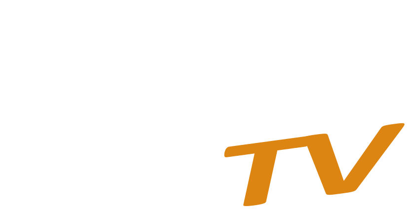

A modern Android TV media streaming application.

### 🛠 Architecture & Tech Stack
*   **📺 UI Framework:** Currently utilizes the **Leanback UI Toolkit** (Legacy). 
*   **🚀 Modernization:** Integration of **Jetpack Compose for TV** is in progress/planned to replace deprecated Leanback components.
*   **💉 DI:** Hilt (Dagger)
*   **📦 Local Storage:** Room Database
*   **🌐 Networking:** Retrofit + GSON

---

### 🎨 Flavors
*   ✅ **online:** Production version. Uses real network calls and local Room database.
*   🧪 **demo:** Mocked version. Uses static local data for UI/UX testing without network requirements.
*   🛠️ **dev:** Development version. Same as `online` but uses a separate package name (`.dev`) to allow side-by-side installation.

---

### 🏗️ Modules
*   📦 **core:** Framework-agnostic logic. Contains ViewModels, Repositories, and Data sources (Room/Retrofit).
*   📺 **leanback-app:** The legacy UI module containing Activities, Fragments, and Presenters based on `androidx.leanback`.
*   🎨 **compose-app (Planned):** The modern UI module leveraging **Compose for TV** for a more flexible and declarative UI.

---

### 📥 Releases
Check the **Releases** panel on the right for the latest APKs and changelogs.

---

### 💻 Tech Summary

